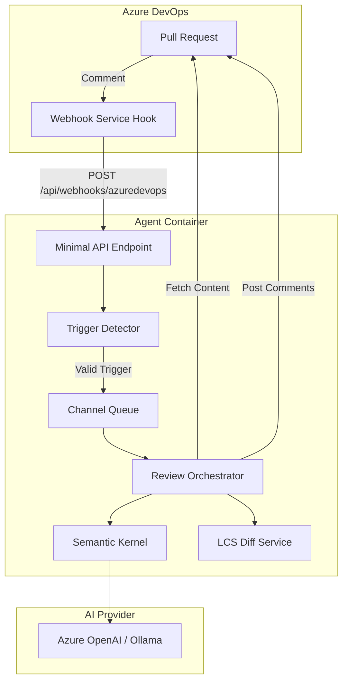
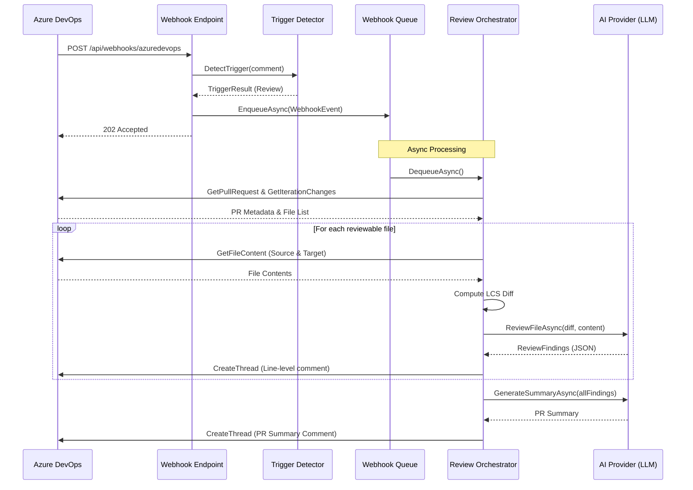
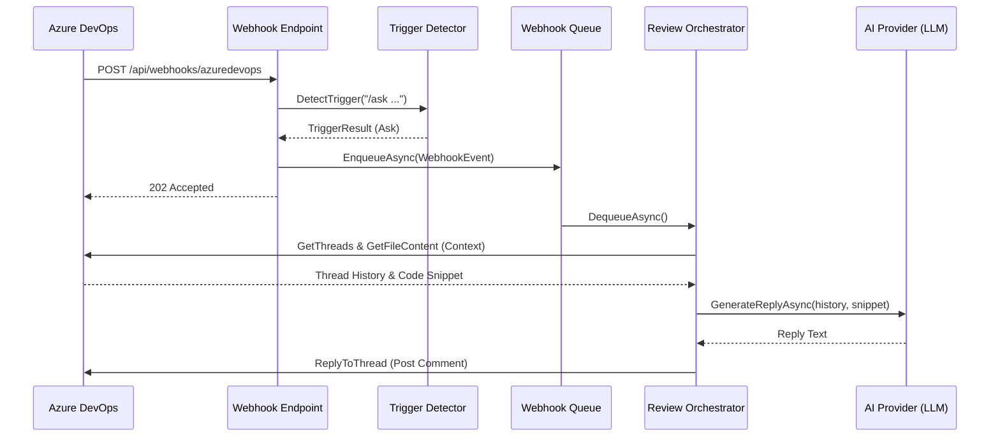

# Azure DevOps Code Review Agent

An intelligent, AI-powered pull request reviewer for Azure DevOps Server (on-premise) and Services. The agent automates code reviews, provides line-level feedback, and handles conversational queries within PR threads using Semantic Kernel.

## Table of Contents
- [Overview](#overview)
- [Architecture](#architecture)
- [Core Pipeline](#core-pipeline)
- [Project Structure](#project-structure)
- [Configuration Reference](#configuration-reference)
- [Deployment](#deployment)
- [Local Development](#local-development)

## Overview

The Azure DevOps Code Review Agent is a .NET 8 Minimal API that integrates with Azure DevOps via webhooks. It monitors pull request comments for specific triggers and performs automated code analysis using Large Language Models (LLMs) like GPT-4o or local models via Ollama/vLLM.

**Key Features:**
- **Automated Reviews:** Triggers on `/review` command or @mention to analyze PR diffs.
- **Line-Level Feedback:** Posts specific findings directly to the PR with suggested code changes.
- **Conversational AI:** Responds to questions within threads via the `/ask` command.
- **Summarization:** Provides a high-level score and assessment of the entire PR.
- **Flexible AI Providers:** Supports Azure OpenAI and OpenAI-compatible endpoints (Ollama, vLLM).

## Architecture

The system follows a producer-consumer pattern using an internal bounded queue to ensure reliable event processing without blocking the webhook ingestion.



### Review Sequence Flow



### Conversation Reply Flow



## Core Pipeline

1.  **Ingestion:** The `WebhookEndpoints` receives events from Azure DevOps. It uses `WebhookAuthMiddleware` for Basic Authentication.
2.  **Detection:** `TriggerDetector` uses regex to identify `/review` or `/ask` commands.
3.  **Queueing:** Valid events are placed into a `Channel<WebhookEvent>` (bounded to 100 items) to decouple ingestion from processing.
4.  **Orchestration:** `ReviewOrchestrator` (a `BackgroundService`) consumes the queue. It manages the lifecycle of a review: fetching metadata, filtering files, computing diffs via `DiffService` (using an LCS algorithm), and calling the `ReviewService`.
5.  **AI Integration:** `ReviewService` leverages Semantic Kernel to communicate with LLMs. It uses embedded prompts for system instructions and handles JSON parsing of findings.
6.  **Persistence:** Findings and summaries are posted back to Azure DevOps via `AzureDevOpsClient`.

## Project Structure

```text
src/AzDoReviewAgent/
├── AzureDevOps/          # API Client and Models
│   ├── Models/           # AzDO REST API DTOs
│   └── AzureDevOpsClient.cs
├── Configuration/        # Options patterns (appsettings mapping)
├── Diff/                 # Diff computation logic
│   ├── DiffService.cs    # LCS-based diffing
│   └── Models/           # Diff data structures
├── Processing/           # Background orchestration
│   ├── ReviewOrchestrator.cs # Main pipeline logic
│   ├── TriggerDetector.cs    # Slash command parsing
│   └── WebhookQueue.cs       # In-process Channel queue
├── Review/               # AI Review logic
│   ├── Prompts/          # Embedded system prompts (.txt)
│   └── ReviewService.cs  # Semantic Kernel implementation
├── Webhooks/             # Webhook ingestion
│   ├── WebhookEndpoints.cs # Minimal API routes
│   └── WebhookAuthMiddleware.cs # Basic Auth verification
├── appsettings.json      # Configuration schema
└── Program.cs            # DI registration and startup
```

## Configuration Reference

The application is configured via `appsettings.json` or Environment Variables.

### AzureDevOps
| Setting | Description |
|---------|-------------|
| `ServerUrl` | Base URL of your AzDO Server (e.g., `https://devops.contoso.com`) |
| `Collection` | Collection name (e.g., `DefaultCollection`) |
| `Pat` | Personal Access Token with Code (Read & Write) permissions |
| `ApiVersion` | AzDO API version (default: `7.0`) |
| `AgentUserId` | GUID or Unique Name of the agent's user account |
| `AgentDisplayName` | Display name for @mention detection |

### Ai
| Setting | Description |
|---------|-------------|
| `Provider` | `AzureOpenAI` or `Ollama` |
| `AzureOpenAi:Endpoint` | Azure OpenAI Resource URL |
| `AzureOpenAi:DeploymentName` | Model deployment name (e.g., `gpt-4o`) |
| `AzureOpenAi:ApiKey` | Azure OpenAI API Key |
| `Ollama:Endpoint` | OpenAI-compatible endpoint (e.g., `http://localhost:11434/v1`) |
| `Ollama:ModelId` | Model name (e.g., `llama3.1`) |
| `MaxTokensPerFile` | Token limit for individual file analysis |
| `Temperature` | LLM temperature (default: `0.2`) |

### WebhookAuth
| Setting | Description |
|---------|-------------|
| `Username` | Basic Auth username for webhook security |
| `Password` | Basic Auth password for webhook security |

### Review
| Setting | Description |
|---------|-------------|
| `FileExtensions` | Whitelist of extensions to review (e.g., `.cs`, `.ts`) |
| `ExcludePatterns` | Glob patterns to ignore (e.g., `*.generated.cs`) |
| `MaxFilesPerReview` | Safety cap for files per PR iteration (default: `50`) |
| `MaxFileSizeBytes` | Skip files larger than this (default: `102400` / 100 KB) |

## Deployment

### Docker Deployment

The agent ships as a single Docker container.

**1. Create a `.env` file** with your secrets:

```env
AZDO_PAT=your-personal-access-token
AZDO_AGENT_USER_ID=00000000-0000-0000-0000-000000000000
AZURE_OPENAI_ENDPOINT=https://your-resource.openai.azure.com/
AZURE_OPENAI_API_KEY=your-azure-openai-key
WEBHOOK_PASSWORD=your-webhook-secret
```

**2. Build and run:**

```bash
docker compose up -d --build
```

The agent listens on port `8080`. Verify it's running:

```bash
curl http://localhost:8080/health
```

### Environment Variables (docker-compose)

| Variable | Maps to | Description |
|----------|---------|-------------|
| `AzureDevOps__ServerUrl` | `AzureDevOps:ServerUrl` | AzDO Server base URL |
| `AzureDevOps__Collection` | `AzureDevOps:Collection` | Collection name |
| `AzureDevOps__Pat` | `AzureDevOps:Pat` | PAT with Code Read/Write scope |
| `AzureDevOps__AgentUserId` | `AzureDevOps:AgentUserId` | Agent identity GUID (to filter own comments) |
| `AzureDevOps__AgentDisplayName` | `AzureDevOps:AgentDisplayName` | Name used for @mention detection |
| `Ai__Provider` | `Ai:Provider` | `AzureOpenAI` or `Ollama` |
| `Ai__AzureOpenAi__Endpoint` | `Ai:AzureOpenAi:Endpoint` | Azure OpenAI endpoint URL |
| `Ai__AzureOpenAi__DeploymentName` | `Ai:AzureOpenAi:DeploymentName` | Deployment name (e.g., `gpt-4o`) |
| `Ai__AzureOpenAi__ApiKey` | `Ai:AzureOpenAi:ApiKey` | Azure OpenAI key |
| `WebhookAuth__Username` | `WebhookAuth:Username` | Basic Auth username |
| `WebhookAuth__Password` | `WebhookAuth:Password` | Basic Auth password |

### Using Ollama (Local AI)

Uncomment the `ollama` service block in `docker-compose.yml`, then set:

```env
Ai__Provider=Ollama
Ai__Ollama__Endpoint=http://ollama:11434
Ai__Ollama__ModelId=llama3.1
```

### Azure DevOps Service Hook Setup

This connects your Azure DevOps project to the agent so PR comment events are forwarded.

1. Navigate to your project in Azure DevOps Server.
2. Go to **Project Settings** > **Service Hooks**.
3. Click **+ Create Subscription** and select **Web Hooks**.
4. **Trigger configuration:**
   - Event type: **Pull request commented on** (`ms.vss-code.git-pullrequest-comment-event`)
   - Resource version: **`2.0`** (required — v1.0 is missing the PR URL in comment events)
   - Optionally filter by repository
5. **Action configuration:**
   - URL: `http://<your-agent-host>:8080/api/webhooks/azuredevops`
   - HTTP headers: *(leave empty)*
   - Resource details to send: **All**
   - Basic authentication username: value of `WebhookAuth:Username`
   - Basic authentication password: value of `WebhookAuth:Password`
6. Click **Test** to verify connectivity, then **Finish**.

> **Important:** Azure DevOps Server on-prem does not support HMAC webhook signatures. The agent uses Basic Authentication over HTTPS with timing-safe password comparison.

## Local Development

1.  **Prerequisites:** [.NET 8 SDK](https://dotnet.microsoft.com/download/dotnet/8.0)

2.  **Initialize user secrets:**
    ```bash
    cd src/AzDoReviewAgent
    dotnet user-secrets init
    dotnet user-secrets set "AzureDevOps:Pat" "your-pat"
    dotnet user-secrets set "AzureDevOps:AgentUserId" "your-agent-guid"
    dotnet user-secrets set "Ai:AzureOpenAi:ApiKey" "your-key"
    dotnet user-secrets set "Ai:AzureOpenAi:Endpoint" "https://your-resource.openai.azure.com/"
    dotnet user-secrets set "WebhookAuth:Password" "local-dev-pass"
    ```

3.  **Run:**
    ```bash
    dotnet run --project src/AzDoReviewAgent/AzDoReviewAgent.csproj
    ```

4.  **Expose for testing:** Use [ngrok](https://ngrok.com/) or a similar tunnel to expose your local port so Azure DevOps can reach it:
    ```bash
    ngrok http 8080
    ```
    Then use the ngrok URL when configuring the Service Hook.

---
*Note: This agent requires an Azure DevOps Server version that supports the PR Comment event (Server 2022+ or Services).*
